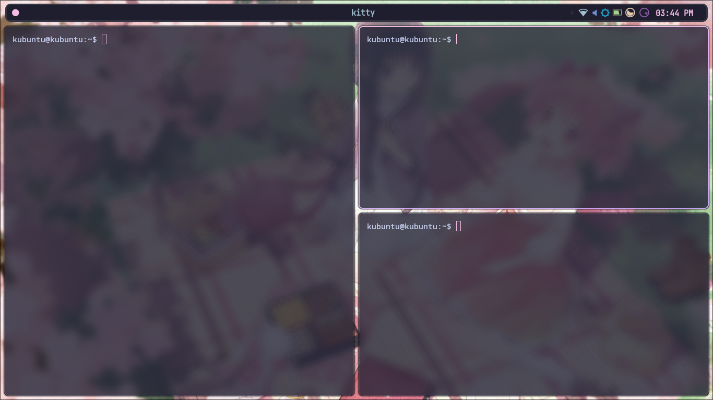

# dotfiles
Dotfiles for Hyprland configuration on Kubuntu.

## Components
- **Window Manager**: Hyprland
- **Launcher**: Wofi
- **Bar**: Waybar
- **Terminal**: Kitty

## Installation

Run the automated installation script:
```bash
./install.sh
```

### What the script does:
1.  **System Updates**: Updates package lists and installs dependencies via `apt` (Wayland protocols, development libraries, etc.).
2.  **Tool Compilation**: 
    - Downloads and compiles `cliphist` (Clipboard manager).
    - Downloads and compiles `hyprshot` (Screenshot tool).
    - Compiles Hyprland ecosystem tools: `hypridle`, `hyprlock`, `hyprgraphics`.
3.  **Configuration**: 
    - Backs up and copies config files to `~/.config/` for Hyprland, Waybar, Wofi, and Kitty.
    - Updates wallpaper configuration in `hyprpaper.conf`.
4.  **Assets**:
    - Installs the default wallpaper to `~/wallpaper/`.
    - Extracts and installs fonts to `~/.local/share/fonts/`.

## Configuration Details

### Wofi
The Wofi launcher is configured to use a **2-column layout**.


## Screenshots

